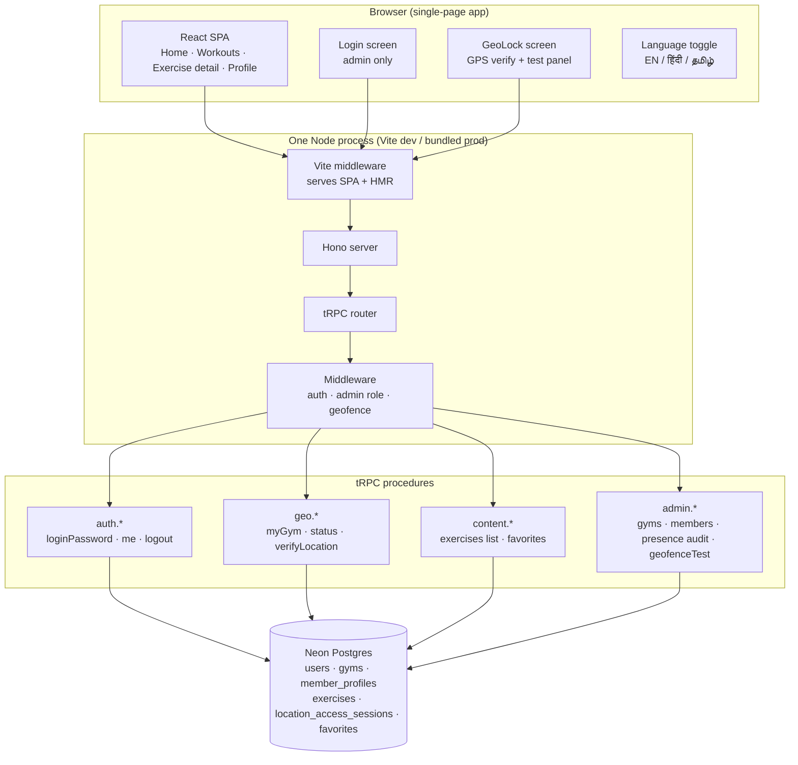
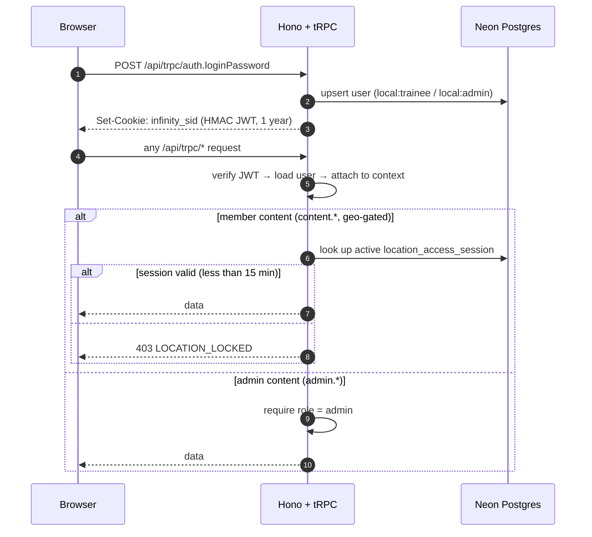
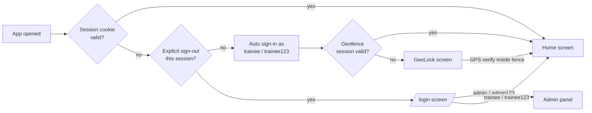
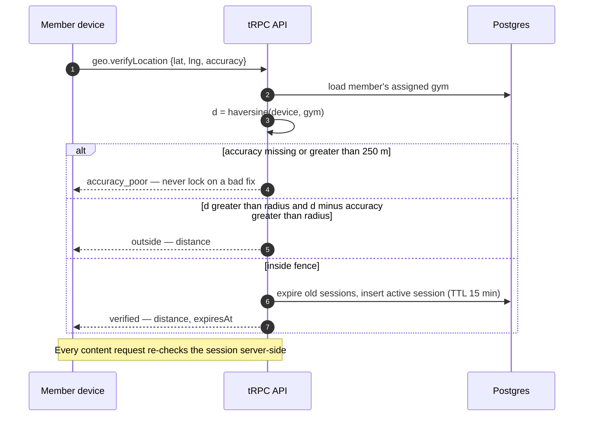
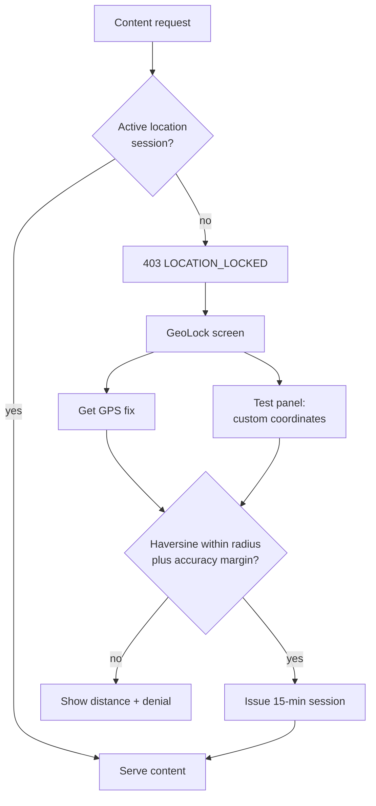
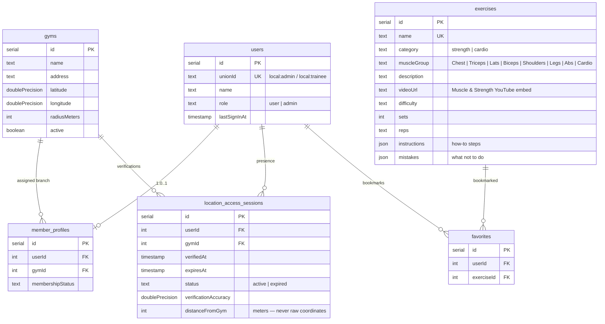

# Infinity Fitness

A kiosk-style gym workout app for a single-branch fitness center. Members walk in, pick a body part, choose any 3 exercise variations, and follow video-guided workouts — all content is geo-fenced to the gym's physical location and available in English, Hindi, and Tamil.

Built as a monorepo: a React SPA + tRPC API in one Vite process, backed by a serverless Neon Postgres database.

---

## Table of contents

- [Features](#features)
- [Tech stack](#tech-stack)
- [System architecture](#system-architecture)
- [Authentication flow](#authentication-flow)
- [Geofencing](#geofencing)
- [Data model](#data-model)
- [Weekly schedule](#weekly-schedule)
- [Getting started](#getting-started)
- [Environment variables](#environment-variables)
- [Testing the geofence](#testing-the-geofence)
- [Deployment](#deployment)
- [Project structure](#project-structure)

---

## Features

- **Body-part workout browser** — Chest, Triceps, Lats, Biceps, Shoulders, Legs, Abs and Cardio categories with 73 exercises; members pick any 3 variations per muscle group.
- **Video-guided exercises** — every exercise embeds a Muscle & Strength YouTube demonstration plus written *how-to* and *what-not-to-do* guidance.
- **Geo-fenced access** — member content unlocks only when the device is physically inside the assigned gym's radius (15-minute authorization window, renewable).
- **Weekly schedule board** — Monday–Saturday split displayed on the home screen with today highlighted; Sunday is rest.
- **Circuit training card** — instructions to run one exercise per body part, back to back.
- **Trilingual UI** — one-tap toggle between English, हिंदी and தமிழ்; all 73 exercise guides are fully translated.
- **Shared-gym mode** — one trainee login used by everyone; the app silently auto-signs members in, no daily login friction.
- **Admin panel** — configure gym branches (coordinates + radius), assign members to branches, audit presence events, and test the fence from any coordinates.
- **Safety first** — warning banner on the workouts screen; the app never silently locks a member whose GPS fix is merely imprecise.

## Tech stack

| Layer    | Choice                                                          |
| -------- | --------------------------------------------------------------- |
| Frontend | React 19 · Vite 7 · Tailwind CSS · shadcn/ui · React Router   |
| API      | tRPC 11 · Hono 4 · Zod                                          |
| Database | Postgres (Drizzle ORM) — [Neon](https://neon.tech) serverless   |
| Auth     | HMAC-signed JWT session cookie (secret derived from DB URL)     |
| Geo      | Haversine distance over GPS coordinates                         |
| i18n     | In-app string dictionaries (EN/HI/TA)                           |

## System architecture



### Request pipeline



## Authentication flow

Shared-gym mode — there is one credential pair for the floor and one for staff:



- The JWT secret is derived from `DATABASE_URL` (SHA-256) — the only secret the deployment carries. Rotating the database password invalidates all sessions.
- An explicit sign-out sets a session flag that suppresses auto sign-in, so staff can stay on the login screen.

## Geofencing

Branch coordinates live **only** in the database (`gyms` table), never in the app bundle. Presence is verified with the Haversine formula; precise coordinates are never stored — only distance-from-gym and GPS accuracy, as an audit trail.





## Data model



Hindi and Tamil exercise content lives in the frontend (`src/lib/i18n/gen/`), keyed by exercise name and merged at render time — the database stores English only.

## Weekly schedule

| Day       | Focus                |
| --------- | -------------------- |
| Monday    | Chest & Triceps      |
| Tuesday   | Back (Lats) & Biceps |
| Wednesday | Shoulders            |
| Thursday  | Legs & Abs           |
| Friday    | Circuit training     |
| Saturday  | Cardio               |
| Sunday    | Rest                 |

The schedule is a read-only board on the home screen (today is highlighted). Members are not locked into a day — they can open any body part and pick their 3 variations.

## Getting started

**Prerequisites:** Node 20+, pnpm, a Neon (or any Postgres) database.

```bash
# 1. install dependencies
pnpm install

# 2. configure the database — the ONLY environment variable
cp .env.example .env
#    then paste your Neon pooled connection string into .env

# 3. create tables and seed the 73-exercise catalog
pnpm db:push
npx tsx db/seed.ts

# 4. run
pnpm dev          # http://localhost:3000
```

Production build & run:

```bash
pnpm build        # bundles SPA + API server to dist/
pnpm start        # serves everything from one Node process
```

Validation: `pnpm check` (types) · `pnpm lint` · `pnpm test` (vitest).

## Environment variables

Exactly one.

| Variable       | Required | Purpose                                                        |
| -------------- | -------- | -------------------------------------------------------------- |
| `DATABASE_URL` | yes      | Postgres connection string. Also keys the session-cookie HMAC. |

`NODE_ENV` and `PORT` are honored with sane defaults (`development`, `3000`) and are not configuration.

## Testing the geofence

Two built-in tools, no GPS spoofing required:

1. **Admin panel → GEOFENCE TEST** — pick a branch, enter any coordinates (or "Use my position"), hit Check. Shows `INSIDE/OUTSIDE the fence` with the exact distance. Creates no session, so it can be used repeatedly.
2. **GeoLock screen → Test with custom coordinates** — runs the real verification pipeline. Enter the branch coordinates to simulate being on-site (unlocks for 15 minutes), or distant coordinates to see the denial with distance.

Backend-only smoke test (after logging in to get a session cookie):

```bash
# locked without a location session
curl -b cookies.txt 'http://localhost:3000/api/trpc/content.exercises.list?batch=1&input=%7B%220%22%3A%7B%22json%22%3A%7B%7D%7D%7D'
# → 403 LOCATION_LOCKED

# verify at the branch → then the same request returns 73 exercises
curl -b cookies.txt -H 'Content-Type: application/json' \
  -d '{"json":{"latitude":12.960293,"longitude":79.154320,"accuracy":10}}' \
  http://localhost:3000/api/trpc/geo.verifyLocation
```

## Deployment

**Docker (all-in-one):**

```bash
docker build -t infinity-fitness .
docker run -p 3000:3000 -e DATABASE_URL="postgresql://..." infinity-fitness
```

**Vercel + Neon:** the database is already external and serverless. Add `DATABASE_URL` in *Project → Settings → Environment Variables*. Note that this app currently serves the API from the same Node process as the Vite frontend — for Vercel, deploy the API as a serverless function (Hono has a `@hono/vercel` adapter) or keep the Docker/VM deployment.

## Project structure

```text
├── api/                  # tRPC API (Hono + tRPC 11)
│   ├── auth-router.ts    #   shared staff/trainee password logins
│   ├── geo.ts            #   geofence verification + location middleware
│   ├── content.ts        #   exercise catalog (geo-gated)
│   ├── admin.ts          #   branch config, members, presence audit, fence test
│   ├── session.ts        #   HMAC JWT sign/verify + cookie auth
│   ├── middleware.ts     #   auth / admin-role guards
│   └── queries/          #   neon connection + user upserts
├── contracts/            # shared constants & errors (frontend + backend)
├── db/
│   ├── schema.ts         #   Drizzle schema (pg-core)
│   └── seed.ts           #   73-exercise catalog + default branch
├── src/
│   ├── pages/            #   Home, Workouts, ExerciseDetail, Profile, Admin, Login
│   ├── components/       #   AppShell, GeoLock, Gates, WarningBanner, ui/…
│   ├── lib/i18n/         #   EN/HI/TA strings + 73-exercise translations
│   └── hooks|providers/  #   useAuth, trpc client
├── Dockerfile            # single-image build (SPA + API)
└── drizzle.config.ts
```

## Security notes

- Branch coordinates are server-side only; clients receive just name, radius and their own distance at verification time.
- Presence audit stores distance and accuracy — never raw GPS coordinates.
- The two password pairs are defined server-side in `api/auth-router.ts`; the trainee pair is a shared kiosk credential, not per-person identity.
- Change both passwords before going to production, and rotate the Neon password if it has ever been shared.
